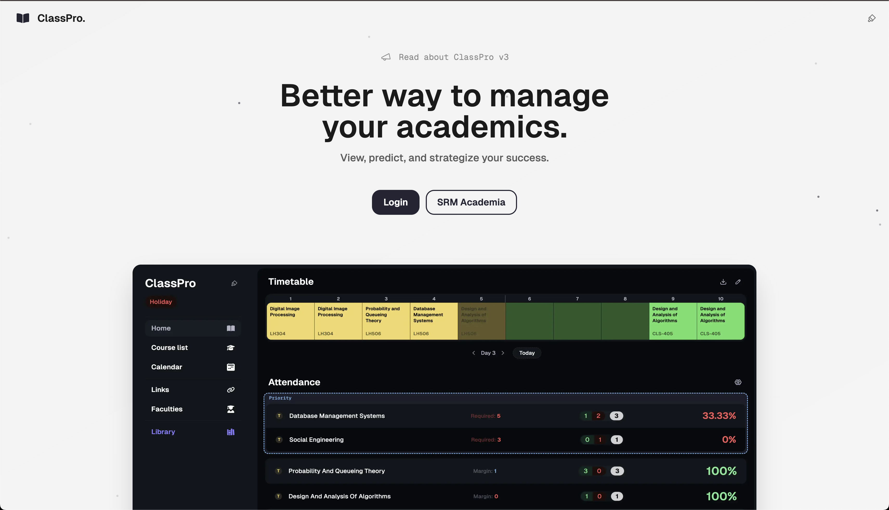

# ClassPro
### Better way to manage your academics.

View, predict, and strategize your success.

> This fork contains the upstream ClassPro monorepo plus reliability and interaction fixes.
> 
> ---
> 
> ## Monorepo Structure
> 
> ```
> classpro/
> ├── frontend/          # Next.js frontend application
> ├── backend/           # Go backend API
> ├── .env.example       # Environment variables template
> ├── package.json
> ├── docker-compose.yml
> └── README.md
> ```


### Prerequisites

- [Bun](https://bun.sh/) (>=1.2.0)
- [Go](https://golang.org/) (>=1.23.0)
- [Docker](https://docker.com/) (optional, for containerized deployment)

### Setup

1. **Clone the repository:**

   ```bash
   git clone --recurse-submodules https://github.com/rahuletto/classpro
   cd classpro
   ```

2. **Install dependencies:**

   ```bash
   # Install the run script
   bun install

   # Install all dependencies
   bun run install:all
   ```

3. **Environment Setup:**
Copy from `.env.example` and paste it in the root directory

```bash
# Optional persistence. The frontend builds without these credentials.
NEXT_PUBLIC_SUPABASE_URL=""
NEXT_PUBLIC_SERVICE_KEY=""
NEXT_PUBLIC_VALIDATION_KEY=""

# Backend-specific values are documented in backend configuration.
```


> [!TIP]
> Generate secure keys for `VALIDATION_KEY` and `ENCRYPTION_KEY`.
>
> **For Linux, macOS, or Windows with Git Bash/WSL:**
>
> ```bash
> openssl rand -hex 32
> ```
>
> **For Windows with PowerShell:**
>
> ```powershell
> [BitConverter]::ToString((New-Object Security.Cryptography.RNGCryptoServiceProvider).GetBytes(32)).Replace("-", "").ToLower()
> ```

### Development

#### Run both services:

```bash
# Frontend (http://localhost:0243)
bun run dev:frontend

# Backend (http://localhost:8080)
bun run dev:backend

# Run the app as a whole
bun run dev
```

### Production Build

```bash
# Build both services as a whole
bun run build

# Build individually
bun run build:frontend
bun run build:backend
```

### Docker Deployment

```bash
# Copy .env into both workspaces first. NEXT_PUBLIC_* values are inlined into
# the client bundle while the frontend image builds, so changing them later
# needs a rebuild rather than a restart.
# Build and run with Docker Compose
bun run docker:build
bun run docker:up

# Stop services
bun run docker:down
```


> [!WARNING]
> We will **NOT** take account for anything caused by your self-hosted instance

## Quality checks

```bash
bun install
cd frontend && bun run lint && bun run build
```

Optional Supabase credentials configure persistence for saved optional hours. Related API routes return HTTP 503 until they are supplied.

## Why Choose ClassPro?

- **Academic overview:** Timetable, course list, attendance, marks, calendar, faculty contacts, and resources.
- **Attendance planning:** Predict outcomes and mark optional hours with validated persistence.
- **Responsive controls:** Touch-sized navigation, labeled fields, visible focus states, and reduced-motion support.
- **Local-first typography:** Fraunces, Sora, and IBM Plex Mono are self-hosted for consistent rendering.
- **Timetable Generation:** Creates a full timetable based on your class schedule.
- **Attendance Prediction:** Predicts the percent based on your expected leave days
- **Safe and Secure:** Built with privacy and security in mind.
- **No Bloat:** Streamlined and efficient, with no unnecessary bloatware.

### The Idea Behind ClassPro

This project was intended to show the timetable and attendance. but it grew and scaled to a full-on replacement to SRM Academia. We made sure to use the web-standards and the best-in-class approaches to make sure our service is `fast`, `easy-to-use` and `easy on eyes`.

## Contributors

See the repository contributor graph for the complete contributor list.


---

## [License](https://creativecommons.org/licenses/by-nc-nd/4.0/)

### You are free to:

- **Share:** Copy and redistribute the material in any medium or format.

### Under the following terms:

- **Attribution:** You must give appropriate credit, provide a link to the license, and indicate if changes were made. You may do so in any reasonable manner, but not in any way that suggests the licensor endorses you or your use.
- **NonCommercial:** You may not use the material for commercial purposes.
- **NoDerivatives:** If you remix, transform, or build upon the material, you may not distribute the modified material.
